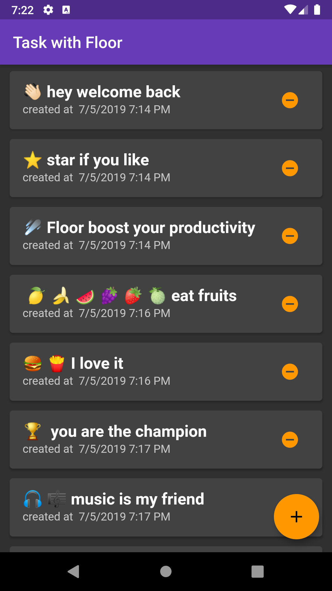
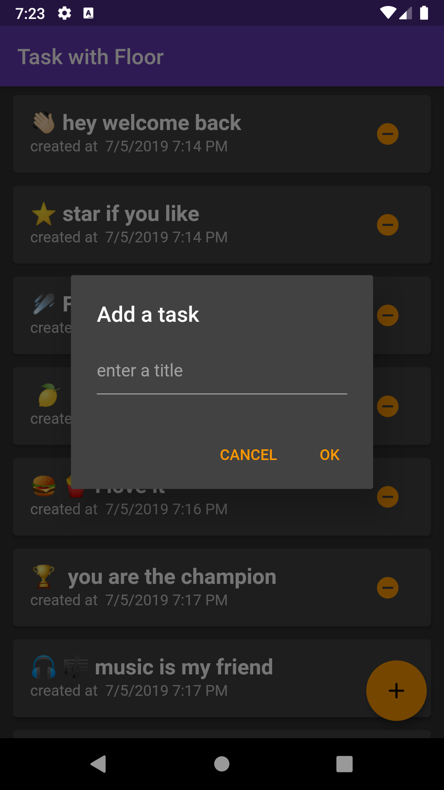
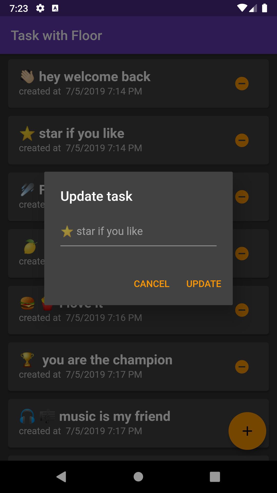

# Task app with Floor

this app use the [Floor package](https://pub.dev/packages/floor)

The Floor library provides a lightweight SQLite abstraction with automatic mapping between in-memory objects and database rows while still offering full control of the database with the use of SQL.

It's important to note that this library is not a full-featured ORM like Hibernate and will never be. Thus not supporting automatic relationship mapping is intentional.

Model 
``` dart 
@entity
class Task {
  @PrimaryKey(autoGenerate: true)
  final int id;

  String title;
  
  final int createdTime;
}
```

Dao
``` dart 

@dao
abstract class TaskDao {
  @Query('SELECT * FROM task WHERE id = :id')
  Future<Task> findTaskById(int id);

  @Query('SELECT * FROM task')
  Future<List<Task>> findAllTasks();

  @Query('SELECT * FROM task')
  Stream<List<Task>> findAllTasksAsStream();

  @insert
  Future<void> insertTask(Task task);

  @update
  Future<void> updateTask(Task task);

  @delete
  Future<void> deleteTask(Task task);

  @Query('DELETE FROM task')
  Future<void> deleteAllTask();
}

```

In addition this branch use the [Provider package](https://pub.dev/packages/provider) for **state management**

Main screeen for the list | Dialog for adding a task | Dialog for update a task
--- | --- | ---
 | | 

